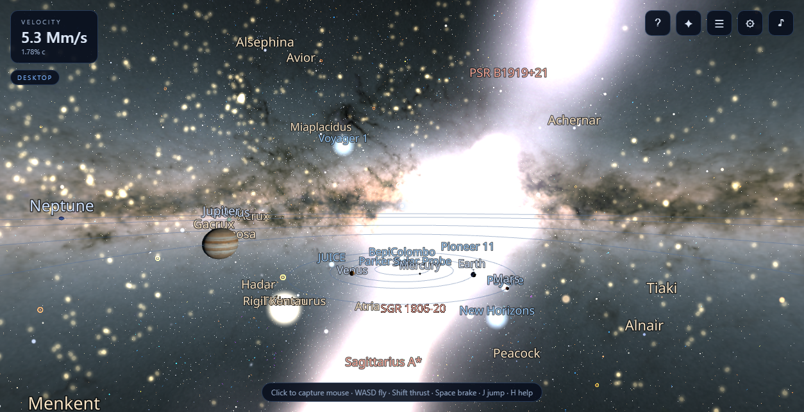
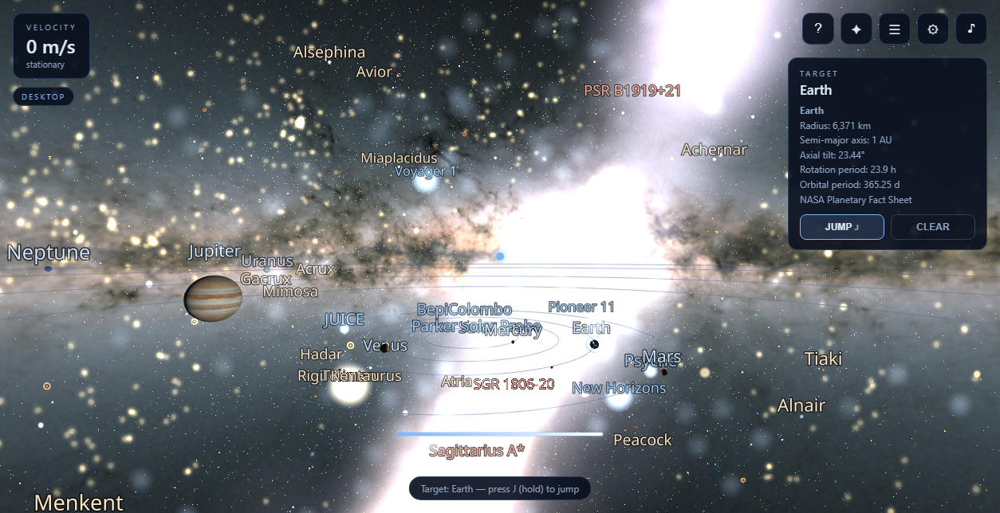

# COSMOS — WebXR Universe Explorer

**Live: [https://cosmos-webxr.pages.dev](https://cosmos-webxr.pages.dev)** — open on desktop, or in
the Meta Quest 3 browser for VR / passthrough AR.

A production-quality universe-exploration web app for **Meta Quest 3 (VR)**, **desktop**, and
**passthrough AR**, built on **real astronomy data** — no fabricated coordinates anywhere in the
real layers.





## Quick start

```bash
npm install
npm run dev        # http://localhost:7100 (host mode enabled for Quest browser on LAN)
```

Then open the URL and pick a mode: **Desktop**, **VR**, or **Passthrough AR**.

> WebXR requires HTTPS outside of `localhost`. For Quest 3 on your LAN, either use a
> tunneling service (e.g. `ngrok http 7100`) or deploy to any static HTTPS host.

## Build & deploy

```bash
npm run build      # → dist/ (static site)
npm run preview    # serve the production build locally
```

Deploy `dist/` to any static host (GitHub Pages, Netlify, Vercel, Cloudflare Pages…).
The app is fully static: all datasets and textures live under `public/` and are copied verbatim.

### Cloudflare Pages (one command)

The repo includes `wrangler.toml` (`pages_build_output_dir = "dist"`). With
[wrangler](https://developers.cloudflare.com/workers/wrangler/) authenticated
(`npx wrangler login` once):

```bash
npm run deploy     # builds dist/ and deploys to Cloudflare Pages
```

Or connect the GitHub repo in the Cloudflare dashboard (Pages → Connect to Git)
with build command `npm run build` and output directory `dist` for push-to-deploy CI.

Deep links: `?mode=desktop|vr|ar` skips the landing screen (VR/AR still needs a headset).

## Re-fetching the data

```bash
npm run fetch-data        # core catalogs + textures into public/data + public/textures
npm run fetch-extra       # atlas layers: cepheids, globulars, galaxies, star names, constellations, landmarks
python scripts/fetch_dust.py   # 3D dust volume (msgpack → dust.bin, needs: pip install msgpack)
node scripts/fetch-data.mjs stars,exoplanets   # or just some steps
```

`public/data/manifest.json` records source name, URL, retrieval date, object count, and license
for every dataset, including any fallbacks that were used.

## Data provenance

| Layer | Source | Count | Notes |
|---|---|---|---|
| Stars | [HYG Database v4.0](https://github.com/astronexus/HYG-Database) (Gaia-derived) | **70,659** | Filter: `dist ≤ 500 pc AND mag ≤ 9`, OR `mag ≤ 6.5` naked-eye. Interleaved Float32 `[x,y,z(pc), mag, B−V]` J2000; 400 brightest named stars labeled. |
| Exoplanets | [NASA Exoplanet Archive](https://exoplanetarchive.ipac.caltech.edu/) TAP `ps` (default_flag=1) | **6,197** | Full confirmed-planet default parameter set with discovery method, radius/mass, period, host spectral type. |
| Deep-sky objects | [OpenNGC](https://github.com/mattiaverga/OpenNGC) | **10,640** | NGC/IC + Messier, mag ≤ 15. Distances included for well-known objects (curated published values). Embedded Messier fallback exists if OpenNGC is unreachable. |
| 3D dust volume | [Leike & Enßlin / Lallement Gaia 3D dust maps](https://github.com/sb2580/k3d_dust) (k3d snapshot) | **81×201×201 voxels** (3.27 MB bin) | Raymarched extinction cube, ±1000 pc (x,y) / ±400 pc (z), galactic frame → equatorial at load. |
| Cepheids | [Skowron+2019 galactic Cepheids](https://github.com/jskowron/galactic_cepheids) | **2,214** | Young-disk map; heliocentric galactic XYZ → equatorial pc, Float32 `[x,y,z, period]`. |
| Globular clusters | Harris catalog via [LVDB](https://github.com/apace7/local_volume_database) | **213** | Milky-Way halo tracers; same binary layout `[x,y,z, metallicity]`. |
| Local Group galaxies | [LVDB](https://github.com/apace7/local_volume_database) + curated M31/M33 | **911** | Oriented galaxy sprites (size/ellipticity/PA), incl. M31 & M33 with published params. |
| Proper star names | [HYG v4.1](https://github.com/astronexus/HYG-Database) proper-name subset | **460** | Hover tags: point at a star to see its name (desktop + XR rays). |
| Constellation figures | [Stellarium modern skyculture](https://github.com/Stellarium/stellarium) + HYG | **679 segments** | Line figures in equatorial pc at each star's real distance. Off by default. |
| Landmarks | Published (l,b,d) positions (see `reference/extract_data.py` provenance) | **29** | Local clouds, galactic structure, Local Group anchors — labeled destinations with zoom windows. |
| Sky backdrop | [ESA/Gaia DR2 all-sky, equirectangular](https://sci.esa.int/web/gaia/-/60196-gaia-s-sky-in-colour-equirectangular-projection) | 2000×1000 PNG | ESA/Gaia/DPAC, CC BY-SA 3.0 IGO. Fallbacks: Solar System Scope milky way → procedural. |
| Planet textures | [Solar System Scope](https://www.solarsystemscope.com/textures/) (CC BY 4.0) | 13 files | 2k set incl. Earth day/night/normal (TIF→PNG converted), Saturn ring alpha. Procedural fallback per-texture. |
| Solar system constants | NASA Planetary Fact Sheets | 8 planets + Sun + Moon | Radii, semi-major axes, axial tilts, rotation/orbital periods (`src/data/solarSystemData.ts`). |
| Missions | NASA/ESA published mission data (curated) | 20 | ISS, Hubble, JWST, Gaia, SOHO, Voyager 1/2, Pioneer 10/11, New Horizons, Parker Solar Probe, Juno, Cassini, Perseverance, Curiosity, MAVEN, JUICE, Psyche, BepiColombo, Tiangong. Basis stated in `missions.json`. |
| Black holes / neutron stars | Published coordinates (curated) | 13 | Sgr A*, M87*, Cygnus X-1, Gaia BH1, Vela & Crab pulsars, SGR 1806-20 magnetar, … (`compact.json`). |

Total committed data: **≈ 16 MB** (6.7 MB catalogs + 9 MB textures, well under the 60 MB budget).

The **Cinematic universes** layer (off by default) is the only fictional content: a segregated
far-offset region of stylized worlds, clearly marked `✦ … (fiction)` in UI, destinations, and
info panels. It never mixes into the real catalogs.

## Architecture

```
src/
  core/App.ts            Renderer (logarithmic depth), camera rig (fixed at origin), XR session mgmt
  data/                  Loaders, types, NASA solar-system constants
  scene/
    StarField.ts         70k stars: THREE.Points + shader (mag→size, B−V→blackbody, twinkle)
    MilkyWay.ts          Gaia sky sphere (world-space, follows head) + spiral dust plane + core glow
    AtlasLayers.ts       Dust volume raymarcher, cepheid/globular points, Local Group sprites, constellations
    StarNames.ts         Ray-hover proper-name tags for 460 named stars
    SolarSystem.ts       Textured planets, real tilts, Saturn ring, Earth day/night shader, Moon
    Exoplanets.ts        Points colored by discovery method
    DSOLayer.ts          10k DSOs: per-type procedural shaders (galaxy/nebula/PN/OC/GCl/SNR)
    CompactObjects.ts    Accretion-disk shader (BHs), rotating beams (pulsars) at real coords
    Missions.ts          Probes parented to real host bodies / heliocentric positions
    CinematicLayer.ts    Fictional overlay (segregated, off by default)
    Labels.ts            troika SDF labels, world-space, constant angular size + per-label zoom windows
    Selection.ts         Universe-local angular ray-picking registry + 3D crosshair marker
  controls/
    Navigation.ts        Atlas model: targets + damped easing, grab, pinch-scale, travel, breadcrumbs
    DesktopControls.ts   Pointer lock, WASD→thrust intent, scroll zoom, Space stop, J/Home/Backspace
    XRControls.ts        Sticks (fly/turn/zoom), grip grab, trigger/A select, B jump, tap-vs-hold X/Y
    HandControls.ts      Hand models, aim laser + cursor, pinch grab / tap-pinch select
  audio/AudioEngine.ts   100% procedural WebAudio (hum, warp, beacon, generative pad)
  ui/                    Landing screen, desktop HUD, full wrist panel, settings store
scripts/fetch-data.mjs   Core data pipeline (catalogs + textures)
scripts/fetch-extra.mjs  Atlas data pipeline (cepheids/globulars/galaxies/names/constellations/landmarks)
scripts/fetch_dust.py    Dust volume pipeline (msgpack → Float32 dust.bin + meta)
scripts/nav-test.mjs     Pure-math tests of the navigation model (npm run test:nav)
scripts/smoke-test.mjs   CDP-driven headless render/interaction/jump test
```

**The atlas navigation model** (ported from the Milky Way Atlas reference). The user NEVER
leaves the origin — instead the `universe` group is translated/rotated/log-scaled around them.
universe-local coordinates are parsecs (equatorial J2000); `universe.scale` = 10^logScale metres
per parsec, clamped to log ∈ **[−7.3, 2.6]** (whole Local Group in the room ↔ museum solar
system filling the room). All controls steer **targets** (`tgtPos` / `tgtQuat` / `targetLog`)
and the universe eases toward them with damped exponential smoothing `k = 1 − e^(−6.5·dt)`:
release a control and the universe settles exactly onto the current target — deliberate,
drift-free motion with **no velocity, no inertia, and no floating origin**. Targets snap when
within float noise, so residual micro-rotation never shows up as phantom speed. Because the
rig never translates, rendered world coordinates always stay within metres of the headset —
float32 jitter never appears from planetary surfaces to Mpc scales, with no recentering pass.

**Speeds that match what you see.** Fly speed derives from the current scale
(`1.6·max(scale·300, 0.25)` m/s, with an AU-scale bracket blended in inside the museum solar
system), so motion always feels proportional to the content on screen. HUD speed, engine hum,
vignette, and the desktop FOV kick all read the universe's REAL eased motion past the user.

**Grab the universe.** One grip/pinch = 1:1 grab (`m = poseNow · poseStart⁻¹ · universeStart`).
Two grips/pinches = pinch-scale (clamped like the sticks) + yaw from the horizontal hand-line,
anchored at the hand midpoint — exactly the reference app's semantics.

**Travel is real travel.** Jumps/home/back ease the universe transform along an
accelerate→cruise→decelerate curve (smootherstep, `dur = 2.6 + 0.5·|Δlog|`), yawing first
(orientation completes in the opening 35%) so you arrive facing the destination, which lands
0.95 m ahead of you. **Back** restores the exact previous pose from a 20-entry breadcrumb
trail. **Stop** (Space / STOP) freezes all motion instantly at the current pose.

**Skybox behavior.** The Gaia all-sky map lives in world space (radius 10⁶ m), follows the
head, and stays orientation-locked to the universe, so stars never swim while you turn. It
fades out beyond ~25–60 kpc of universe-local travel so the procedural spiral disk (real
galactic-plane orientation, core glow at the true Sgr A* position) becomes the galaxy's
visual. In passthrough AR the skybox is OFF by default (toggleable in LAYERS).

**Skybox alignment.** The Gaia equirectangular map is wrapped on a sphere; with three.js
`SphereGeometry` mapping (`u = 0.5 − RA/2π`), the sphere is rotated −266.4° about Y so the
texture's galactic center sits at the real Sgr A* direction (RA 266.405°, Dec −29.008°).

## Controls & gestures

The user stays at the origin; every input moves/scales/turns the universe around you.

### Desktop
| Input | Action |
|---|---|
| Click canvas | Capture mouse (pointer lock); click again = select object under reticle |
| Mouse | Look (yaw on the rig, pitch on the camera) |
| `W A S D` / `Q` `E` | Move / down / up (universe slides opposite the gaze) |
| `Shift` (hold) | 4× move speed |
| Scroll | Log-scale zoom (hard-clamped) |
| `Space` | **Stop** all motion instantly |
| `J` (hold) | Charge & jump to selected target |
| `Home` | Return home (solar system) |
| `Backspace` | Backtrack (breadcrumb) |
| `O` / `N` | Toggle orbits / labels |
| `D` / `L` / `H` / `M` | Destinations / layers / help / mute |

HUD buttons: ⌂ home · ⏮ back · ? help · ✦ destinations · ☰ layers · ⚙ settings · ♪ mute.

### XR controllers
| Input | Action |
|---|---|
| Left stick | Fly (head-relative) |
| Right stick X | Turn — smooth (snap-turn 45° in settings) |
| Right stick Y | Log-scale zoom (hard-clamped) |
| Grip (hold) | Grab the universe 1:1 and drag it |
| Both grips | Pinch to scale · twist to yaw (midpoint-anchored) |
| Trigger / `A` | Select object under ray |
| `B` | Jump to selected |
| `X` tap / hold | Toggle labels / **Back** (breadcrumb) |
| `Y` tap / hold | Toggle orbits / **Return Home** |
| Left wrist | **Full panel**: speed/target, JUMP, STOP, HOME, BACK, destinations (paged), all layer toggles (incl. skybox), settings (vignette, snap turn, music, volume, elevation, planet size) |

Haptics: grab start/end ticks, jump-charge crescendo, UI hover ticks, arrival thump.

### Hand tracking (degrades gracefully to controllers)
| Gesture | Action |
|---|---|
| Aim | Visible hand models; wrist→middle-MCP ray with laser + cursor dot and angular magnetism |
| Pinch (hold) | Grab the universe 1:1 and drag it |
| Two pinches | Stretch to scale · twist to yaw |
| Tap-pinch | Select under cursor / press panel button |
| Pinch-hold on panel | Detach panel to float in space / re-attach to wrist |

## Comfort

- Vignette during high speed (ON by default, also in VR)
- Snap-turn or smooth turn; turn-speed slider
- Seated/standing toggle
- All motion is pilot-initiated (no forced camera moves except the jump you trigger)

## Audio (all procedural — no files)

Engine hum pitch/volume follows real speed (it climbs through the jump) · warp charge riser +
whoosh · arrival thump · UI ticks · spatialized HRTF beacon ping on the selected target ·
optional **ambient generative music** — consonant major/minor triads only, 10–16 s attacks,
35–60 s chord changes with 20 s crossfades, warm lowpassed triangle+sine blend, ≤1 ¢ detune,
very low default level. Master volume + mute in settings (`M`) and on the wrist panel.

## Verification

`npm run build` and `npx tsc --noEmit` are both green. Two test layers:

- **`npm run test:nav`** — pure-math tests of the real `Navigation` class (bundled with esbuild,
  run in node, no DOM): easing convergence onto targets, hard zoom clamps at log −7.3 / 2.6,
  desktop thrust with zero inertia after release, 1:1 grab semantics, and a
  quickJump → goBack round-trip that restores the exact origin pose (err 0.000%).
- **`node scripts/smoke-test.mjs`** (requires Chrome) — boots the app headlessly under
  SwiftShader WebGL and verifies: boot with zero console errors, a **jump round-trip**
  (Saturn → back to Earth, target lands ~0.95 m ahead each time), thrust with decay-to-zero
  speed after release, STOP halting all motion, galaxy-scale views at 100 pc / 1 kpc / 50 kpc,
  Return Home from 50 kpc, and breadcrumb Back restoring the deep-space pose
  (see `docs/screenshots/`).
